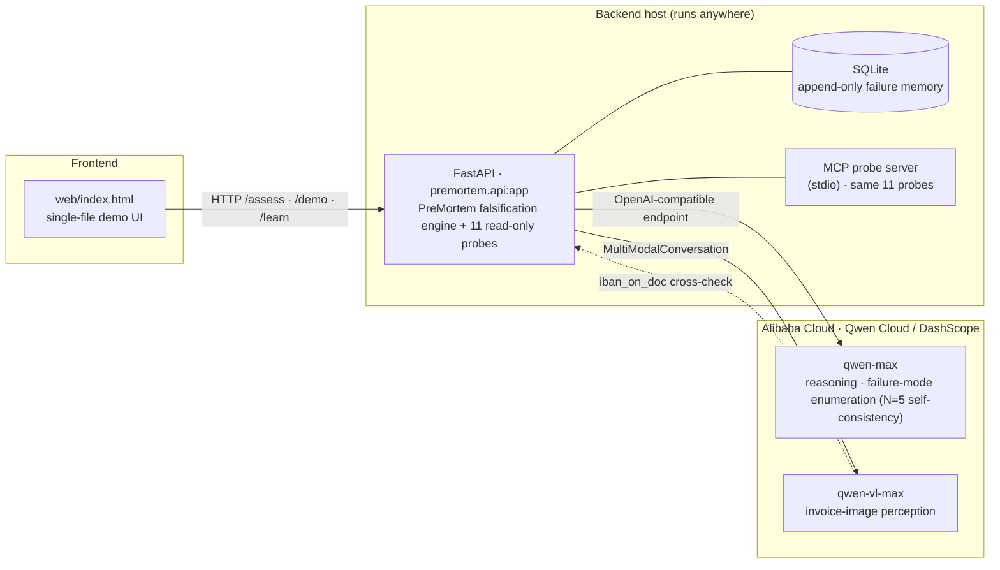
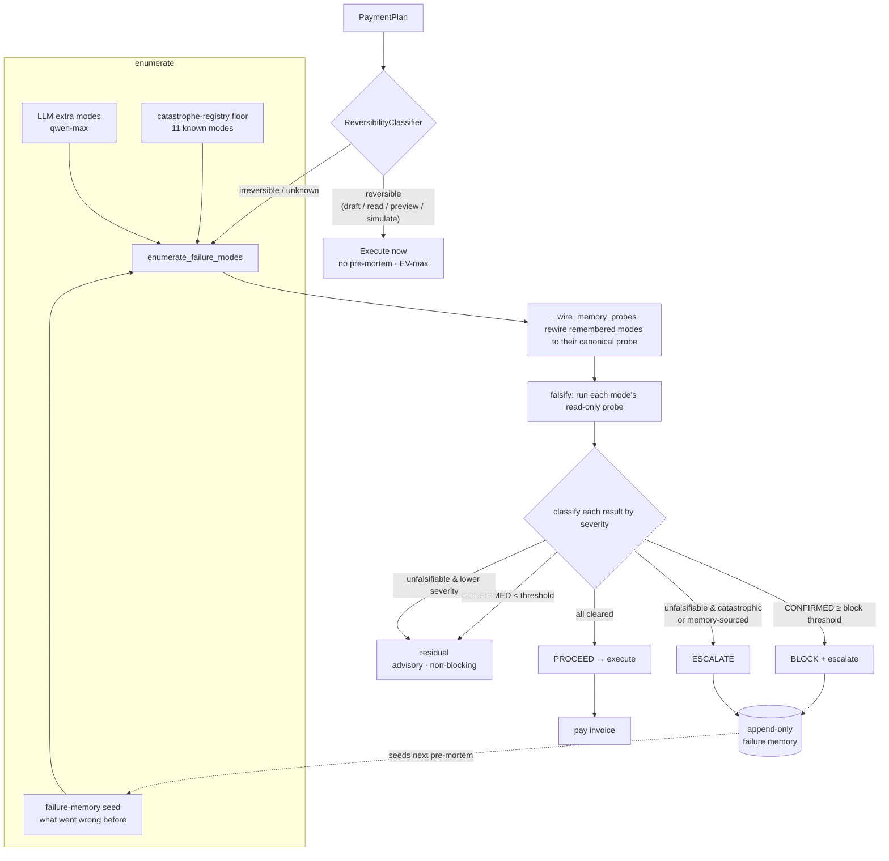

# Architecture

PreMortem is a **falsification engine wrapped in a two-regime policy**. The whole design
exists to make one decision trustworthy: *should this irreversible action execute?*

## 0. System architecture (deployment view)

How the pieces connect — frontend, backend, datastore, and the **Qwen Cloud (Alibaba Cloud)**
model legs. The model inference (`qwen-max` + `qwen-vl-max`) is the part that runs on Alibaba
Cloud; the deployment-proof code file the rules ask for is
[`llm/dashscope_adapter.py`](../src/premortem/llm/dashscope_adapter.py) (live transcript:
[live-vl-evidence.md](live-vl-evidence.md)).

## 1. Control flow

## 2. The two regimes (why a gate at all)

A pre-mortem is expensive — multiple model calls and probe round-trips. Spending it on a
reversible action (drafting a preview you can throw away) is waste. So the first decision is
**ReversibilityClassifier** ([src/premortem/reversibility.py](../src/premortem/reversibility.py)):

- **Rules first.** Money-movement verbs (`pay`, `wire`, `送金`, `transfer_funds`, `remit`,
  `settle`) → `IRREVERSIBLE`. Cheap-to-undo verbs (`draft`, `preview`, `read`, `simulate`,
  `validate`, `lookup`, `list`) → `REVERSIBLE`.
- **LLM only to break ties.** If no rule matches, ask `qwen-max` — but the LLM can **never
  downgrade** an unknown action to reversible (invariant I5). A clean rule hit spends **zero**
  LLM calls.
- **Unknown defaults to irreversible.** The policy treats `UNKNOWN` like `IRREVERSIBLE`: when
  in doubt, run the pre-mortem.

Reversible → execute immediately, `verdict = None`. Irreversible/unknown → the engine runs.

## 3. Enumeration is grounded, not imagined

`enumerate_failure_modes` ([src/premortem/premortem.py](../src/premortem/premortem.py)) is the
union of three sources, de-duplicated:

1. **Memory seed** — modes pulled from the append-only failure store for this action
   fingerprint *or* this vendor (so a fraud seen at $48k still seeds a $5k payment to the same
   vendor).
2. **Registry floor** — the 11 always-checked catastrophe modes in
   [catastrophe_registry.json](../src/premortem/data/catastrophe_registry.json), so the floor
   never depends on the model remembering to be paranoid.
3. **LLM extra** — additional modes `qwen-max` proposes for this specific plan.

Then `_wire_memory_probes()` rewires each remembered mode to its **canonical registry probe**
(e.g. a remembered `new_payee_first_payment` is wired to the `vendor_age` probe) so probeable
remembered modes *confirm* instead of auto-escalating. Truly unprobeable ones (e.g.
`goods_not_received`) stay unwired — and that is exactly the learning signal.

## 4. Falsification is severity-graded

`falsify()` runs each mode's **read-only** probe and grades the outcome against a block
threshold (default `Severity.HIGH`):

| Probe outcome | Severity vs threshold | Result |
|---------------|----------------------|--------|
| CONFIRMED | at or above threshold | **BLOCK** + escalate, remember |
| CONFIRMED | below threshold | residual (advisory, non-blocking) |
| unfalsifiable (no probe ran) | catastrophic **or** memory-sourced | **ESCALATE**, remember |
| unfalsifiable | lower severity | residual (non-blocking) |
| cleared (probe ran, not confirmed) | — | cleared |

This is the core epistemic stance: a confirmed catastrophe stops the money; a danger that is
real but *cannot be checked* is **escalated, never guessed away**; a low-severity unknown is
surfaced as advisory without blocking the business.

**Severity order:** `CATASTROPHIC(0) < HIGH(1) < MEDIUM(2) < LOW(3)`; block when
`rank ≤ block_rank` (default `HIGH`, rank 1).

## 5. The Qwen-irreplaceable leg

The `image_consistency` probe reads the invoice **image** via `qwen-vl-max`
([perception/vision.py](../src/premortem/perception/vision.py)) and cross-checks the IBAN
printed on the document (`source_image_facts.iban_on_doc`) against the IBAN in the payment plan.
A text-only agent has no way to run this probe — it would trust the structured field. This is
the `tampered_img` scenario, and it is the architectural justification for the multimodal model.

Because Qwen Cloud returns **no logprobs**, confidence on the reasoning legs comes from
**self-consistency**, and it is wired into the verdict path — not just measured. The enumeration
leg is sampled N times (`complete_samples`, N=5 by default, `PREMORTEM_SELF_CONSISTENCY_N`); the
engine reads the **modal agreement** before trusting any single answer
([premortem.py `_llm_extra_modes`](../src/premortem/premortem.py)). If agreement falls below the
escalate floor (`escalate_agreement`, default 0.6) the engine injects a synthetic
**catastrophic, unprobeable** mode `llm_enumeration_unstable` — so the model failing to agree with
itself about an irreversible payment's risk landscape flows through the *same* falsification rule
as any other unprobeable catastrophe and **escalates to a human** (I5). It can never be silently
cleared. Where an LLM leg and a probe leg both bear on the same mode, the verdict still **anchors
on the probe** (invariant I6), because the LLM legs are correlated and the probe is independent
grounding. (`tests/test_self_consistency.py` pins this end-to-end.)

## 6. MCP surface

All eleven read-only probes are exposed as **MCP tools**
([mcp_server.py](../src/premortem/mcp_server.py)): `bank_detail_diff`, `vendor_age`,
`duplicate_check`, `amount_anomaly`, `approval_list`, `bank_country_mismatch`, `round_number`,
`image_consistency`, `currency_check`, `tax_id_check`, `po_match`. Any Qwen-Agent or MCP client can call them to ground its own
reasoning. Every tool is read-only (I2) and returns the same `{confirmed, evidence, probe_ran}`
shape the engine consumes. This is the "MCP integrations" signal the Qwen Cloud rubric scores under
Technical Depth (`tests/test_mcp_server.py` pins the full surface).

## 7. Provider abstraction

`QwenClient` is an ABC ([llm/base.py](../src/premortem/llm/base.py)) with two implementations:

- **MockAdapter** — deterministic, creds-free, the **default**. Every verdict in the demo and
  tests is reproducible offline.
- **DashScopeAdapter** — the real Qwen Cloud client. `complete()` over the OpenAI-compatible
  endpoint (`qwen-max`); `vision()` over DashScope `MultiModalConversation` (`qwen-vl-max`,
  `vl_high_resolution_images=True` for dense invoices). Performs **no calls at import** — only
  when a method is invoked.

Selected by `PREMORTEM_LLM` (`mock` | `dashscope`). **The engine code is identical in both
modes** — only the adapter changes — so what the tests prove on mock is what runs in production.

## 8. Persistence & concurrency

Failure memory is an **append-only** SQLite table — no UPDATE/DELETE path, so learning is
monotone and inspectable with any sqlite client. The FastAPI app holds one process-global
`FailureMemory`; the connection is opened with `check_same_thread=False` and every read/write is
serialized by a lock, because uvicorn runs sync endpoints in a worker threadpool.

## Invariants

| # | Invariant | Enforced in |
|---|-----------|-------------|
| I1 | Irreversible/unknown never executes without `PROCEED` | `policy.py`, `test_policy.py` |
| I2 | Every probe is read-only | `probes/`, `mcp_server.py` |
| I3 | Confirmed failure ≥ threshold → BLOCK + escalate | `premortem.py`, `test_premortem.py` |
| I4 | Every block/override/post-hoc miss → appended to memory | `policy.py`, `test_policy.py` |
| I5 | Unfalsifiable danger → ESCALATE (never guessed) | `premortem.py`, `test_scenarios.py` |
| I6 | Correlated LLM legs → anchor on the non-LLM probe leg | `premortem.py` |
